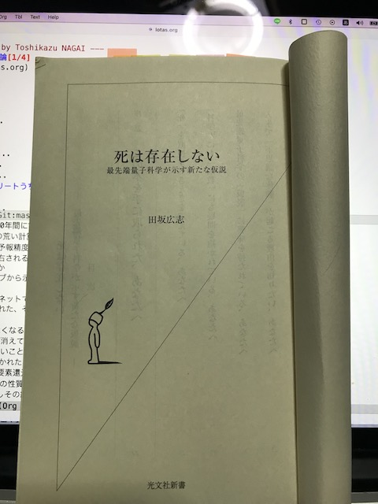
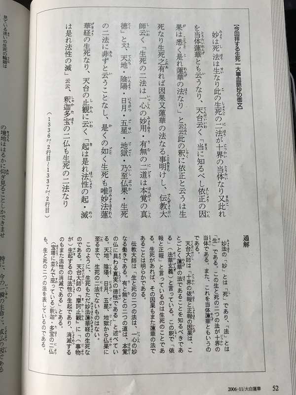

# 天気予報と料理力学と法華経論

Status: Lab  
Author: riichi  
Created: 2023-04-10  
Updated: 2026-02-25  
Version: 0.1  

---

## 1. 天気予報が当たらない

2018年6月、気象庁のスーパーコンピューターが一新された。  
日立製からクレイ製へ変更され、処理能力は約10倍になったと報じられていた。

私は2018年4月に気象関連の仕事を離れたが、処理能力が10倍になれば予報精度も向上すると当然のように思っていた。山の遭難や海難事故も減少し、この分野は安泰だと感じていた。

しかし2019年、地元福岡を襲った台風の影響で自宅の屋根が破損した。修理のため天気予報を注視したが、予報が当たらない。

3日先どころか翌日の天気さえ怪しい。25年前、若手の気象予報士が「3日は必ず当てる自信がある」と語っていたことを思い出す。

処理能力は10倍になったはずなのに、なぜ精度は向上しないのか。

---

## 2. 温暖化の影響ではないのか

仮に桜の開花時期が30年間で1か月前倒しになったと仮定する。

さらにスパコン性能が1000%向上したと仮定すると、

極めて粗い計算だが、温暖化の影響が予測精度を大きく揺るがすとは考えにくい。

---

## 3. 要素還元主義の限界

『死は存在しない』（田坂広志）に、現代科学の三つの限界が示されていた。

1. 分析すると本質が見えなくなる  
2. ミクロの世界では物質が消える  
3. 現代科学では説明できないことがある  

スパコンによる数値予報は、各気象要素を分解し初期値を与え、シミュレーションする。

これは典型的な要素還元主義である。

もし世界そのものが要素の総和ではないとしたらどうだろうか。

---

## 4. 量子もつれとホログラム宇宙

### 4.1 量子もつれ

量子は粒子と波の性質を併せ持つ。量子もつれ状態では、観測によって一方が確定すると、もう一方も瞬時に確定する。

- EPRパラドックス  
- ベルの不等式  

実験により量子もつれは現実であることが示された。

---

### 4.2 ブラックホールとホログラム理論

ベッケンシュタインとホーキングは、ブラックホールの情報量（エントロピー）が体積ではなく面積に比例することを示唆した。

これは宇宙がホログラム的構造を持つ可能性を示している。

> 我々の三次元世界は、宇宙表面の二次元情報の投影ではないか。

---

## 5. 天気予報が当たらない理由（仮説）

もし世界がホログラム的であり、物質に実体がないとするなら、要素還元主義による精密計算は本質を捉えられない可能性がある。

スパコンの性能向上が予測精度に直結しないのは、世界の構造そのものが非還元的だからではないか。

---

## 6. ゼロポイントフィールド仮説

ゼロポイントフィールドとは、量子もつれ情報を記録する宇宙表面の情報層のようなものだと考えている。

まだ学術的に整理はできていないが、直感的には説明力を持つ仮説である。

---

## 7. 個人的体験と死後観

### 7.1 母の死

2020年8月22日、母が亡くなった（享年83）。

死後しばらく、母の存在を感じていた。49日を過ぎた頃、それは消えた。

---

### 7.2 父の死

2021年11月8日、父が亡くなった。

不可解な物音や現象が続いたが、一回忌を過ぎた頃、それも消えた。

ゼロポイントフィールドへ移行したと考えると、体験は一貫する。

---

## 8. 法華経と量子力学

大白蓮華2006年11月号に関連を感じる記述があった。

「当体蓮華」という概念は、形状と時間の永遠性を象徴している。

これはホログラム宇宙や量子もつれに通じるのではないか。

---

## 9. 量子もつれの参考動画

- https://www.youtube.com/watch?v=73Fa1fA4S5E  
- https://youtu.be/nYh-n7EOtMA  

---

## 最後に

- 法華経を理解したとは言えない。  
- 量子脳や意識も未学習である。  
- 本稿は仮説段階であり、今後の学習と検証を続けたい。
  
